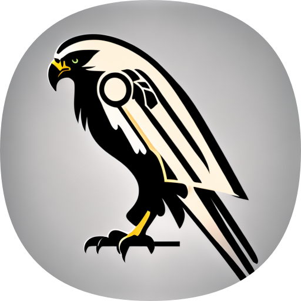

# 👋 Welcome to Habrok Documentation

<figure><figcaption></figcaption></figure>

## About

Habrok (named after [Hábrók](https://en.wikipedia.org/wiki/H%C3%A1br%C3%B3k)) is a Discord bot useful for staff members to identify how appreciated or toxic someone is in your community.

## Quick links


[adding-the-bot.md](overview/adding-the-bot.md)



[support-server.md](overview/support-server.md)

