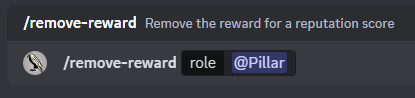

# 🛬 removing a reward

## Permission

This command is available to Administrators only.

## Purpose

<figure><figcaption></figcaption></figure>

This commands allows you to remove a reward.

## Arguments

### role

This is the role currently given as the reward you wish to remove.


This command will neither delete the role nor remove it from your server members.


## Example

<figure><figcaption></figcaption></figure>
