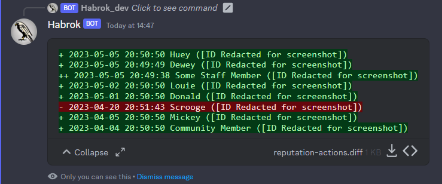

# 👀 Checking a member's reputation

## Permission

This command is available to members with the permission "Manage Messages".

## Purpose

<figure><figcaption></figcaption></figure>

<figure><figcaption></figcaption></figure>

This commands allows you to check a member's reputation score.


The detailed view shows "++" or "--" when the person who rated the community member is a staff member


## Arguments

### user

The member whose reputation score you wish to check.

## Example

<figure><figcaption></figcaption></figure>

<figure><figcaption></figcaption></figure>

<figure><figcaption></figcaption></figure>
